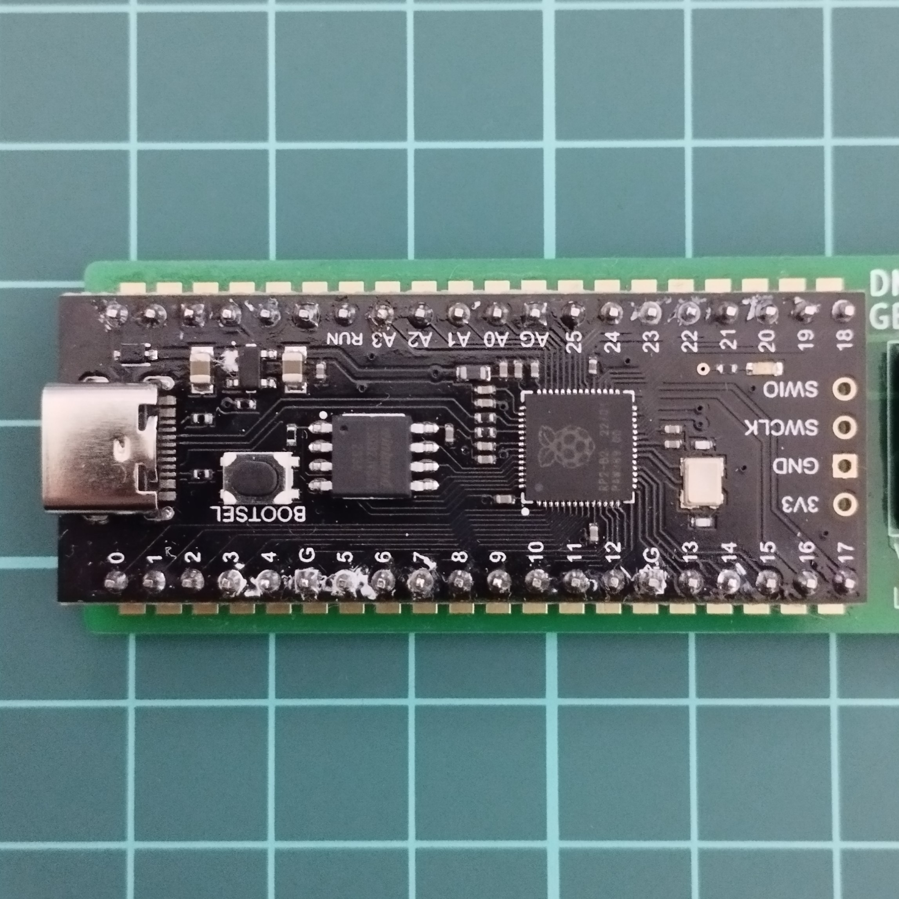

# Tested Components List

This page contains the components that have been tested with the adapter board. This page is based on my personal test and also data from the community.

Please contribute if you found new compatible/incompatible components.

## Raspberry Pi Pico

In theory every raspberry pi pico clones with the same pinout should work.

| Compatible | Pictures | Shop/Datasheet Link | Description |
|-|-|-|-|
| Yes |  | [Link](https://www.raspberrypi.com/products/raspberry-pi-pico/) | Original Raspberry Pi Pico |
| Yes |  | [Link](https://www.raspberrypi.com/products/raspberry-pi-pico/) | Original Raspberry Pi Pico W|
| Yes |  | [Link](https://www.aliexpress.com/item/1005003928558306.html) | RP2040 Lite Black TYPE-C 4M|

## Level Shifter

Becareful of bad quality clones.

| Compatible | Pictures | Shop/Datasheet Link | Description |
|-|-|-|-|
| Yes |    | [Link](https://www.sparkfun.com/products/12009) | Original Sparkfun 4 Channel Level Shifter |
| Yes |    |  |  |
| Yes |    | [Link](https://www.amazon.co.jp/-/en/gp/product/B0CL2R6K26/) |  |
| No |    | [Link](https://www.amazon.co.jp/-/en/gp/product/B081RH1P4L) | Thin PCB, Low Quality Board |
