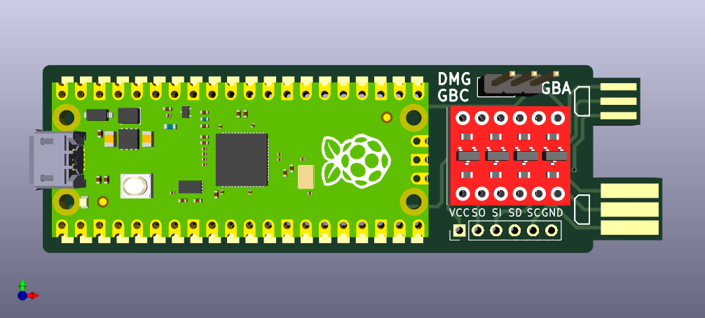
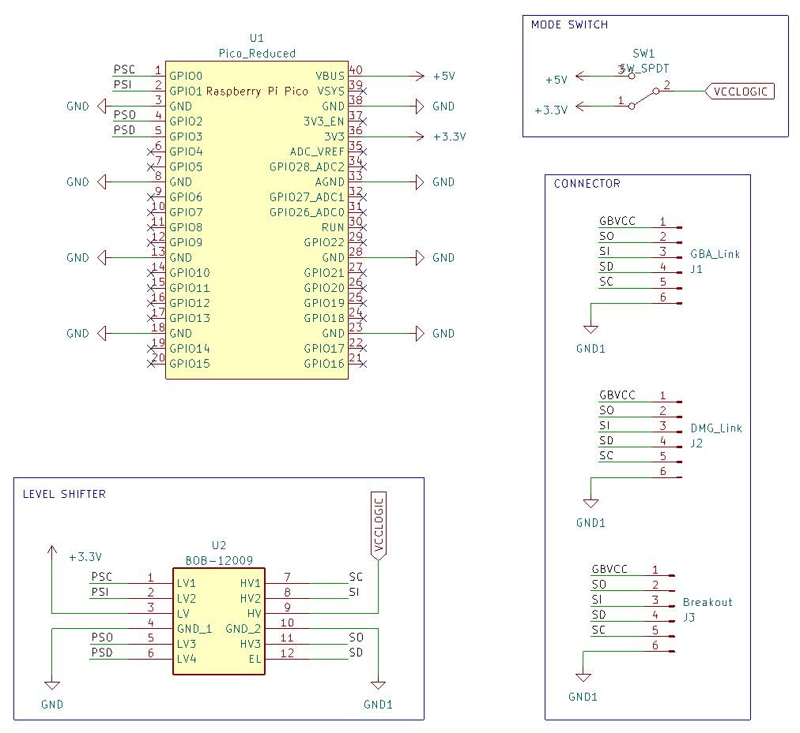

# Game-Boy-Pico-Link-Board

An Open-Source USB to Gameboy Link Cable Adapter for Raspberry Pi Pico. Designed with components that are easy to source and solder.

Based on stacksmashing Gameboy Link adapter: https://www.youtube.com/watch?v=KtHu693wE9o

# Schematic

# Required Components

| Reference | Part Number | Description |
|-|-|-|
| U1 | [Raspberry Pi Pico](https://www.raspberrypi.com/products/raspberry-pi-pico/) | Clones are compatible |
| U2 | [BOB-12009](https://www.sparkfun.com/products/12009) | Sparkfun Bi-Directional Logic Level Converter, clones are compatible |
| SW1 | [SS12D00-G3](https://www.amazon.com/Tnuocke-Vertical-Position-Switches-SS12D00-G3/dp/B099MRCDG8) | 3 Pin SPDT Switch with 1" (2.54mm) Pitch |

If you want to use pin jumper instead of switch you can use:

| Reference | Part Number | Description |
|-|-|-|
| SW1 | [Pin Header](https://www.amazon.com/dp/B07PKKY8BX) | 1x3 2.54mm Male Pin Header |
| - | [Pin Jumper](https://www.amazon.com/dp/B077957RN7) | 2.54mm Pin Jumper, harvest from old motherboard or hardrive |

**Attached links are for reference only, you can use any equivalent parts.**

# How to Order Board

To order a board, use the `gerbers.zip` from the release page or generate one yourself. You can order from your favourite PCB manufacturer ([JLCPCB](https://jlcpcb.com/), [PCBWay](https://www.pcbway.com/), etc.).

**Use 1.2mm PCB thickness.**

You can choose any colour for the Solder Mask and Silkscreen. For the Surface Finish, ENIG is recommended.

# How to Assemble Board

1. Trim the Link Cable connectors width on the board to the appropriate size using a file tool or sandpaper
2. Solder pin header to Raspberry Pi Pico and Level Shifter module. Use a breadboard for easier soldering
3. Solder Raspberry Pi Pico and Level Shifter module to the board
4. Cut the excessive pin using a nipper tool
5. Solder the 1x3 Pin Header to the board, and place the Pin Jumper
6. Flash firmware to your Raspberry Pi Pico (see [Compatibility](#Compatibility))

# How to Use Board

Connect the board to your PC, and connect the board to your Gameboy using a Link Cable.

For Gameboy/Gameboy Color game, place the pin jumper on the DMG/GBC side. For Gameboy Advance game, place the pin jumper on the GBA side.

**Be aware Gameboy/Gameboy Color mode uses 5V logic, while Gameboy Advance mode uses 3.3V logic. Make sure your pin jumper is placed on the correct side to avoid any damage.**

# Compatibility

This board is compatible with the following firmware:
- https://github.com/Lorenzooone/gb-link-firmware-reconfigurable (Recommended Firmware)
- https://github.com/stacksmashing/gb-link-firmware
- https://github.com/stacksmashing/gb-link-printer
- https://github.com/Lorenzooone/PokemonGB_Online_Trades
- https://github.com/dj505/GBPrinterEmu
- https://github.com/Squaresweets/GBPrinter-discord-bot
- https://github.com/KuestenKeks/pc-to-gb-printer

With some modification, it should be compatible with other firmware as well, such as:
- https://github.com/untoxa/pico-gb-printer

# References

- Raspberry Pi Pico Footprint: https://github.com/ncarandini/KiCad-RP-Pico
- Logic Level Converter (BOB-12009) Footprint: https://www.snapeda.com/parts/BOB-12009/SparkFun%20Electronics/view-part/
- Gameboy Link Connector Footprint: https://github.com/Palmr/gb-link-cable
- 1.2mm PCB Thickness, based on: https://hackaday.io/project/12932-game-link-online/log/43999-received-the-breakout-boards
